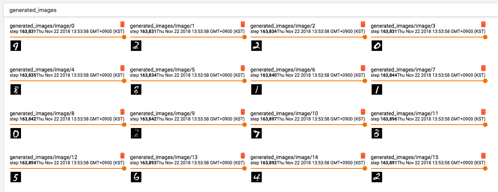

# TensorFlow Implementation of Conditional GAN (cGAN)

Unofficial TensorFlow implementation of [Conditional Generative Adversarial Nets](https://arxiv.org/abs/1411.1784). 

## Prerequisites
* Python 3.6
* TensorFlow 1.12 (have to check backward compatibility)

## Usage

### Train

* Train a model

`$ python main.py --name=cGAN --batch_size=128 version=0.1`

* Use TensorBoard

`$ tensorboard --logdir=./logs/{model_name}/{version}`

### Test

in-progress

## Results

## To-do

-[ ] Build test interface
-[ ] Add serialised inputs for TF Serving
-[ ] Switch from `tf.layers` to `tf.keras.layers` (due to deprecation of `tf.layers` in TensorFlow 2.0)  
-[ ] Support various datasets
-[ ] Replace results into clean images rather than captured one from TensorBoard